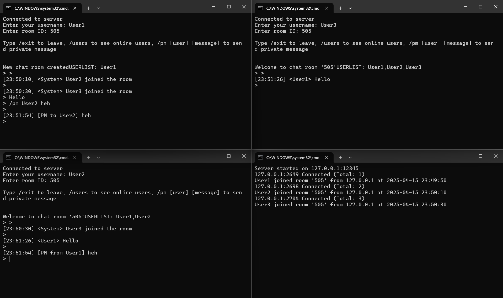
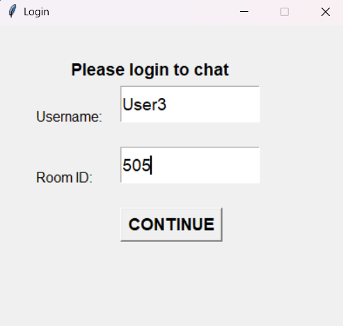
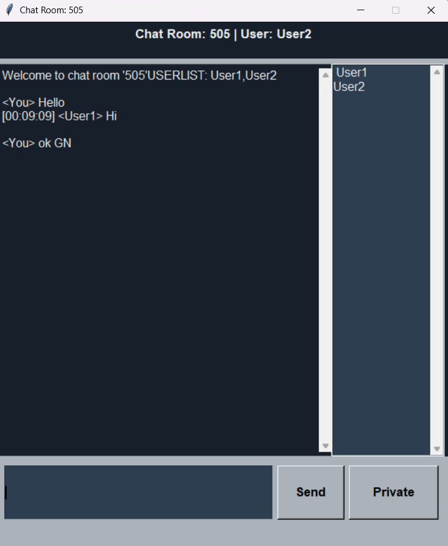

# Socket Chat

A simple chat application with TLI and GUI clients using Python sockets.

## Features

- Real-time public and private messaging
- Multiple chat rooms
- Online user list
- Both TLI and GUI interfaces

## Screenshots

| TLI Messaging | GUI Login | Chat Gui |
|------------|------------|-------------------|
|  |  |  |

## Quick Start

Start the server:
```bash
python server.py

2. Run clients:
# CLI version
python client.py

# GUI version
python ChatGUI.py
```
## Basic Commands
Public chat: Just type and press Enter

Private message: /pm username your-message (CLI) *** If you wanna send a pv message to someone just click on the username in the user list then click on Private button

Exit: /exit

List users (CLI): /users

## Requirements
Python 3.6+

Tkinter
